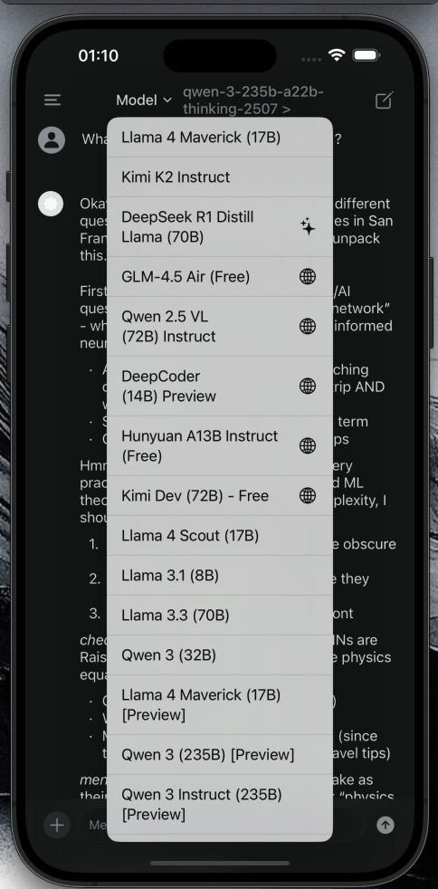

<p align="center">
  
</p>

# Saylo - AI Chat Assistant

A modern iOS React Native chat application with AI integration, featuring multiple AI model providers and comprehensive theming support.

## ✨ Features

- 🤖 **Multiple AI Models**: Support for Groq, Cerebras, and OpenRouter AI providers
- 🌙 **Dark/Light Mode**: Complete theming system with auto-detection
- 🔐 **Secure Authentication**: Clerk-based authentication with Apple and Google OAuth
- 💬 **Streaming Responses**: Real-time AI chat with streaming message support  
- 📱 **Native iOS Experience**: Built with React Native and Expo for optimal performance
- 🎨 **Modern UI**: Clean, intuitive interface with smooth animations
- 🔒 **Privacy First**: Local storage for API keys and chat history

## 🖼️ App Screenshots

<p align="center">
  
  
  
</p>

## 🚀 Quick Start

### Prerequisites

- **Node.js 20.19.4** (Required for iOS build compatibility)
- **Xcode 15+** (for iOS development)
- **Expo CLI** (`npm install -g @expo/cli`)
- **iOS Simulator** or physical iOS device

### Installation

1. **Clone the repository**

   ```bash
   git clone https://github.com/QsingularityAi/ios_react_native_chatbot.git
   cd ios_react_native_chatbot
   ```

2. **Install dependencies**

   ```bash
   npm install
   # or
   bun install
   ```

3. **Set up environment variables**
   - Copy `.env.example` to `.env` (if exists)
   - Add your Clerk Publishable Key to `.env`:

     ```env
     EXPO_PUBLIC_CLERK_PUBLISHABLE_KEY=your_clerk_key_here
     ```

4. **iOS Setup**

   ```bash
   cd ios && pod install && cd ..
   ```

5. **Run the app**

   ```bash
   npm run ios
   # or
   expo run:ios
   ```

## 🔧 Configuration

### Authentication Setup (Clerk)

1. Create a Clerk account at [clerk.com](https://clerk.com)
2. Create a new application
3. Enable Apple and Google OAuth providers
4. Add your Clerk Publishable Key to `.env`
5. Configure OAuth redirect URLs:
   - **Apple**: `saylo://auth-redirect`
   - **Google**: `saylo://auth-redirect`

### AI Model Providers

The app supports multiple AI providers. Configure API keys in the Settings screen:

#### Groq

- Models: Llama, Kimi, DeepSeek R1
- Get API key: [console.groq.com](https://console.groq.com)

#### Cerebras

- Models: Llama, Qwen
- Get API key: [cloud.cerebras.ai](https://cloud.cerebras.ai)

#### OpenRouter

- Models: Various open-source models
- Get API key: [openrouter.ai](https://openrouter.ai)

## 🏗️ Architecture

```text
├── app/                    # Expo Router pages
│   ├── (auth)/            # Authenticated routes
│   ├── (modal)/           # Modal screens
│   └── index.tsx          # Welcome screen
├── components/            # Reusable components
│   ├── auth/             # Authentication components
│   ├── Chat*.tsx         # Chat-related components
│   ├── ThemeProvider.tsx # Theme management
│   └── useApi.tsx        # API integration
├── constants/            # App constants
│   ├── Colors.ts         # Theme colors
│   └── Styles.ts         # Global styles
├── utils/               # Utilities
│   ├── Database.ts      # SQLite operations
│   ├── Storage.ts       # MMKV storage
│   └── Interfaces.ts    # TypeScript interfaces
└── ios/                 # iOS native code
```

## 🎨 Theming

The app includes a comprehensive theming system:

- **Auto Mode**: Follows system theme
- **Light Mode**: Clean, bright interface
- **Dark Mode**: OLED-friendly dark theme
- **Persistent**: Theme preference saved locally

Theme colors are defined in `constants/Colors.ts` and managed by `ThemeProvider.tsx`.

## 📱 Screens

- **Welcome**: App introduction and authentication
- **Chat**: Main chat interface with AI
- **Settings**: API key configuration and preferences
- **Auth Redirect**: OAuth callback handling

## 🔒 Privacy & Security

- API keys stored securely using Expo SecureStore
- Chat history stored locally using SQLite
- No data sent to external services except chosen AI providers
- OAuth handled through Clerk's secure infrastructure

## 🛠️ Development

### Project Scripts

```bash
npm start          # Start Expo development server
npm run ios        # Run on iOS simulator
npm run android    # Run on Android emulator  
npm run web        # Run on web browser
npm run prebuild   # Generate native code
npm test          # Run tests
npm run lint      # Run ESLint
```

### Code Style

- **TypeScript**: Strict typing enabled
- **ESLint**: Code linting and formatting
- **Prettier**: Code formatting (if configured)

### Build System

- **React Native**: 0.76.6 with New Architecture
- **Expo SDK**: 52
- **Node.js**: 20.19.4 (required for iOS compatibility)

## 📦 Dependencies

### Core

- `react-native`: 0.76.6
- `expo`: ~52.0.0
- `@clerk/clerk-expo`: Authentication
- `expo-router`: Navigation

### AI Integration

- `@cerebras/cerebras_cloud_sdk`: Cerebras API
- `groq-sdk`: Groq API integration

### Storage & Database

- `expo-sqlite`: Local database
- `react-native-mmkv`: Fast key-value storage
- `@react-native-async-storage/async-storage`: Settings storage

### UI & Theme

- `@expo/vector-icons`: Icon library
- `react-native-keyboard-controller`: Keyboard handling

## 🚨 Troubleshooting

### iOS Build Issues

- Ensure Node.js version is 20.19.4
- Run `cd ios && pod install` if pods are outdated
- Clean build: `expo prebuild --clean`

### Authentication Issues

- Verify Clerk configuration
- Check OAuth redirect URLs
- Ensure app scheme matches (`saylo://`)

### API Issues

- Verify API keys in Settings
- Check network connectivity
- Review API rate limits

## 🤝 Contributing

1. Fork the repository
2. Create a feature branch (`git checkout -b feature/amazing-feature`)
3. Commit your changes (`git commit -m 'Add amazing feature'`)
4. Push to the branch (`git push origin feature/amazing-feature`)
5. Open a Pull Request

## 📄 License

This project is licensed under the MIT License - see the [LICENSE](LICENSE) file for details.

## 🙏 Acknowledgments

- Original inspiration from [ChatGPT Clone React Native](https://github.com/Galaxies-dev/chatgpt-clone-react-native)
- Built with [Expo](https://expo.dev/)
- Authentication powered by [Clerk](https://clerk.com/)
- AI integration with [Groq](https://groq.com/), [Cerebras](https://cerebras.ai/), and [OpenRouter](https://openrouter.ai/)

---

Made with ❤️ by QsingularityAi